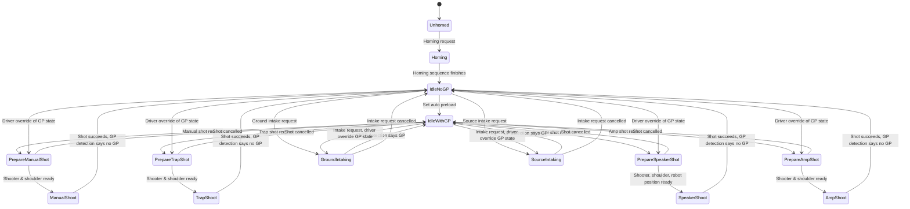

# States

```mermaid
stateDiagram-v2
    [*] --> Unhomed
    Unhomed --> Homing: Homing request

    Homing --> IdleNoGP: Homing sequence finishes

    IdleNoGP --> IdleWithGP: Set auto preload

    IdleWithGP --> PrepareManualShot: Manual shot request
    IdleNoGP --> PrepareManualShot: Driver override of GP state
    PrepareManualShot --> IdleWithGP: Shot cancelled
    PrepareManualShot --> ManualShoot: Shooter & shoulder ready
    ManualShoot --> IdleNoGP: Shot succeeds, GP detection says no GP

    IdleWithGP --> PrepareTrapShot: Trap shot request
    IdleNoGP --> PrepareTrapShot: Driver override of GP state
    PrepareTrapShot --> IdleWithGP: Shot cancelled
    PrepareTrapShot --> TrapShoot: Shooter & shoulder ready
    TrapShoot --> IdleNoGP: Shot succeeds, GP detection says no GP

    IdleWithGP --> PrepareSpeakerShot: Speaker shot request
    IdleNoGP --> PrepareSpeakerShot: Driver override of GP state
    PrepareSpeakerShot --> IdleWithGP: Shot cancelled
    PrepareSpeakerShot --> SpeakerShoot: Shooter, shoulder, robot position ready
    SpeakerShoot --> IdleNoGP: Shot succeeds, GP detection says no GP

    IdleWithGP --> PrepareAmpShot: Amp shot request
    IdleNoGP --> PrepareAmpShot: Driver override of GP state
    PrepareAmpShot --> IdleWithGP: Shot cancelled
    PrepareAmpShot --> AmpShoot: Shooter & shoulder ready
    AmpShoot --> IdleNoGP: Shot succeeds, GP detection says no GP

    IdleNoGP --> GroundIntaking: Ground intake request
    GroundIntaking --> IdleWithGP: GP detection says GP
    GroundIntaking --> IdleNoGP: Intake request cancelled

    IdleNoGP --> SourceIntaking: Source intake request
    SourceIntaking --> IdleWithGP: GP detection says GP
    SourceIntaking --> IdleNoGP: Intake request cancelled

    IdleWithGP --> GroundIntaking: Intake request, driver override GP state
    IdleWithGP --> SourceIntaking: Intake request, driver override GP state
```
